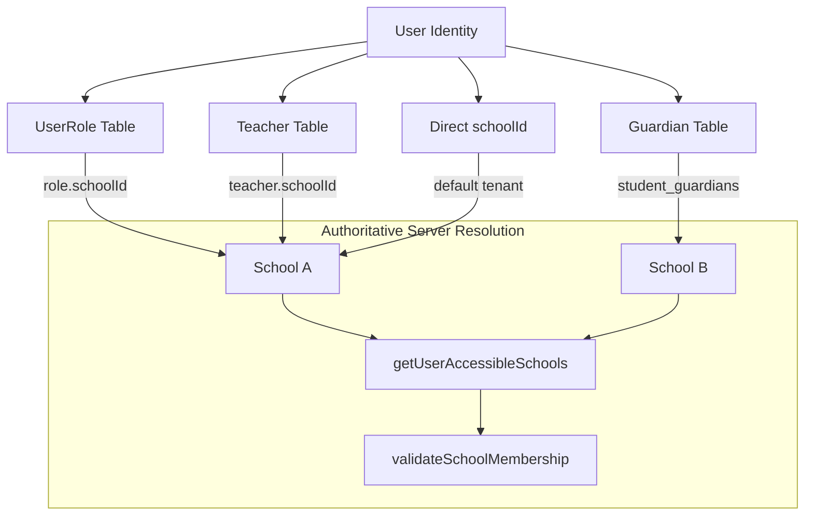
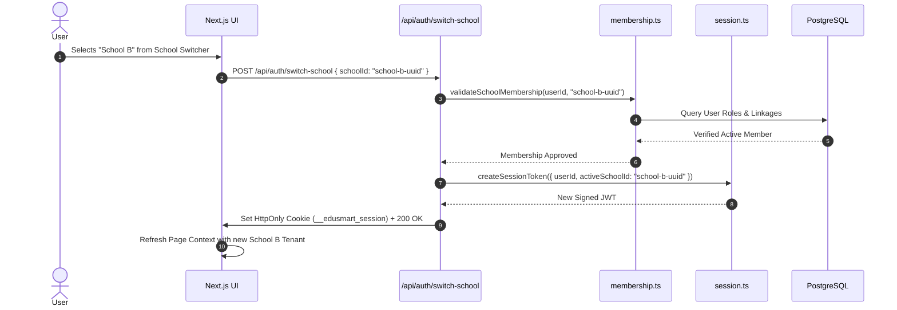
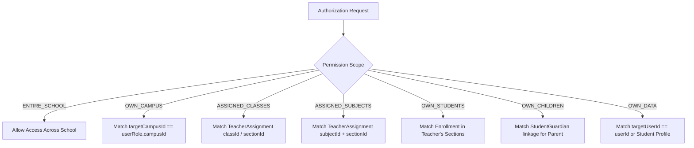
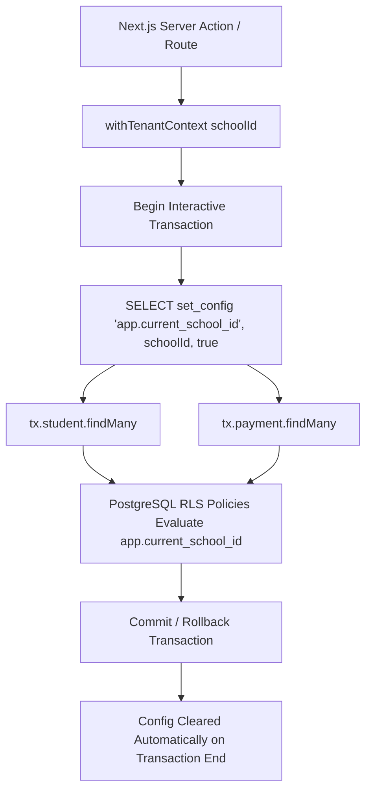
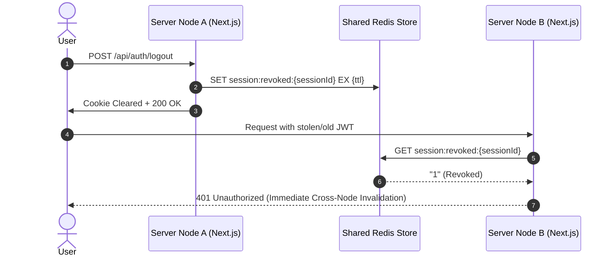

# EduSmart BD — Authentication, RBAC & Tenant Security Architecture (Phase 2 Specification)

## 1. Executive Architecture Summary

**EduSmart BD** is a multi-tenant School Management Software-as-a-Service designed specifically for educational institutions in Bangladesh. The system enforces strict multi-tenant isolation, defense-in-depth authorization, and zero-trust data access patterns.

### Core Architectural Principles
- **Defense in Depth**: Authorization is enforced across four distinct layers: Edge Middleware -> Route Handler Zod Validation -> Application-Level Permission & Scope Engine -> PostgreSQL Row-Level Security (RLS).
- **Single Next.js Monorepo Stack**: Full-stack Next.js App Router with TypeScript and Route Handlers. There is no separate backend server or microservice layer.
- **Stateless Verified Sessions with Server Revocation**: Cryptographically signed HMAC-SHA256 JWT tokens transmitted via `HttpOnly`, `SameSite=Lax`, `Secure` cookies, paired with server-side revocation tracking.
- **Tenant Context Immutability**: Client-supplied `schoolId` values in request bodies, headers, or query parameters are never trusted without authoritative server-side membership validation.
- **Zero Database Schema Changes**: Leverages the production-verified V3.1 database architecture, all 57 models, and 61 RLS policies without modification.

---

## 2. Identity Model

### Unified User Entity
A single human user exists as a unique `User` record in PostgreSQL (`users` table). Users can hold multiple personas (e.g., a teacher in School A who is also a parent of a student in School B).

```
+--------------------------------------------------------------------------------+
|                                     USER                                       |
|  - id: UUID (Primary Key)                                                      |
|  - phone: VarChar(30) [Unique normalized BD format: +8801XXXXXXXXX]           |
|  - email: VarChar(255) [Optional, case-insensitive lowercase]                  |
|  - passwordHash: VarChar(255) [bcrypt, salt rounds = 12]                       |
|  - isSuperAdmin: Boolean [Platform bypass, isolated from school roles]        |
|  - status: ACTIVE | INACTIVE | SUSPENDED | LOCKED                             |
+--------------------------------------------------------------------------------+
        |                     |                     |                     |
        v                     v                     v                     v
+---------------+     +---------------+     +---------------+     +---------------+
|   UserRole    |     |    Teacher    |     |   Guardian    |     |    Student    |
| (School Roles)|     | (Staff Link)  |     | (Parent Link) |     |(Enrolled Link)|
+---------------+     +---------------+     +---------------+     +---------------+
```

### Bangladeshi Identifier Normalization
- **Phone Numbers**: Automatically normalized using `normalizePhone()`:
  - Strips whitespace, hyphens, and parentheses.
  - Converts local prefixes (`017...`, `88017...`) to canonical standard `01XXXXXXXXX`.
  - Enforces valid Bangladesh mobile operator codes (`013`, `014`, `015`, `016`, `017`, `018`, `019`) with exactly 11 digits.
- **Email Addresses**: Normalized by trimming and converting to lowercase.

### Account Status Lifecycle
- `ACTIVE`: Normal access permitted.
- `INACTIVE`: Account created but not yet activated or pending email/phone verification.
- `SUSPENDED`: Administratively suspended by school administrator or platform superadmin.
- `LOCKED`: Temporarily locked due to brute-force throttling threshold triggers (5 consecutive failed attempts).

---

## 3. Multi-School Membership Architecture

A user can belong to multiple schools simultaneously through 4 distinct database relationships:
1. **Direct User School Assignment** (`User.schoolId`): Primary school affiliation.
2. **Role Assignments** (`UserRole` -> `Role.schoolId`): Roles assigned within specific tenant schools.
3. **Faculty / Staff Profile** (`Teacher.schoolId`): Active employment record in a school.
4. **Parent / Guardian Linkage** (`Guardian` -> `StudentGuardian` -> `Student.schoolId`): Parent of enrolled students.



### Authoritative Membership Verification Algorithm
When a user attempts to perform an operation in `schoolId`:
1. Server loads all accessible school IDs via `getUserAccessibleSchools(userId)`.
2. Validates that `targetSchoolId` is in the returned list.
3. If not found and user is not `isSuperAdmin`, execution is immediately halted with `403 Forbidden`.
4. Client-supplied `schoolId` headers or payload parameters are rejected if unverified.

---

## 4. Active School & Active Campus Selection Flow

### Multi-School Navigation & Session Switching


---

## 5. Session Management Architecture

### Cryptographic Token Format
- **Algorithm**: HMAC-SHA256 (`HS256`) via `jose` library.
- **Signing Secret**: `AUTH_SECRET` (256-bit cryptographically secure secret key).
- **Token Claims**:
  ```json
  {
    "userId": "aaaaaaaa-1111-1111-1111-aaaaaaaaaaaa",
    "sessionId": "4f8a9b2c-1d3e-4a5f-8b9c-0e1f2a3b4c5d",
    "activeSchoolId": "11111111-1111-1111-1111-111111111111",
    "activeCampusId": null,
    "isSuperAdmin": false,
    "iat": 1725184800,
    "exp": 1725789600
  }
  ```

### Cookie Configuration
- **Cookie Name**: `__edusmart_session`
- **HttpOnly**: `true` (Inaccessible to client JavaScript, mitigates XSS token theft).
- **Secure**: `true` in production (Transmitted over HTTPS only).
- **SameSite**: `Lax` (Prevents CSRF on cross-site requests while supporting top-level navigation).
- **Path**: `/`
- **Max-Age**: `604800` (7 Days).

### Server-Side Revocation Cache
- In-memory thread-safe `revokedSessions` Set with unique `sessionId` tracking.
- Instant token revocation upon logout or password reset.
- Extensible to Redis distributed cache for multi-instance deployments.

---

## 6. Role-Based Access Control (RBAC) Architecture

### Database RBAC Schema Structure
```
+--------------------+       +--------------------+       +--------------------+
|       roles        |       |  role_permissions  |       |    permissions     |
| - id: UUID         | 1   * | - id: UUID         | *   1 | - id: UUID         |
| - school_id: UUID? |<------| - role_id: UUID    |------>| - module: Enum     |
| - code: VarChar    |       | - permission_id    |       | - action: Enum     |
| - is_system_role   |       | - scope: Enum      |       | - code: VarChar    |
+--------------------+       +--------------------+       +--------------------+
          ^
          | 1
          |
          | *
+--------------------+
|     user_roles     |
| - user_id: UUID    |
| - role_id: UUID    |
| - campus_id: UUID? |
+--------------------+
```

### System Roles vs Custom Roles
1. **System Roles** (`isSystemRole = true`, `schoolId = NULL` or `schoolId = currentSchool`):
   - `SCHOOL_OWNER`: Institutional superuser. Full permissions across all school modules.
   - `PRINCIPAL`: Academic & administrative head. Full school-wide access.
   - `ADMIN`: General administrator. Full operational access except institutional ownership settings.
   - `TEACHER`: Instructional faculty. Scoped to assigned subjects/classes/students.
   - `ACCOUNTANT`: Financial bursar. Full billing, fees, and payments. View-only discounts.
   - `STUDENT`: Enrolled student. Scoped strictly to `OWN_DATA`.
   - `PARENT`: Guardian. Scoped strictly to `OWN_CHILDREN`.
2. **Custom School Roles** (`isSystemRole = false`, `schoolId = currentSchool`):
   - Schools can define custom roles (e.g., `EXAM_COORDINATOR`, `LIBRARIAN`, `SPORTS_TEACHER`) with custom combinations of permissions and scopes.

---

## 7. Complete Permission Catalog

The catalog defines 44 distinct granular permissions across 12 modules and 13 actions:

| Module | Code | Action | Description | Default Scope |
| :--- | :--- | :--- | :--- | :--- |
| **STUDENTS** | `STUDENTS_VIEW` | VIEW | View student demographics and enrollments | ENTIRE_SCHOOL |
| | `STUDENTS_CREATE` | CREATE | Register new student admissions | ENTIRE_SCHOOL |
| | `STUDENTS_UPDATE` | UPDATE | Modify student profile records | ENTIRE_SCHOOL |
| | `STUDENTS_DELETE` | DELETE | Archive or delete student profiles | ENTIRE_SCHOOL |
| | `STUDENTS_EXPORT` | EXPORT | Export student records (Excel/CSV) | ENTIRE_SCHOOL |
| **ACADEMICS** | `ACADEMICS_VIEW` | VIEW | View classes, sections, subjects, routines | ENTIRE_SCHOOL |
| | `ACADEMICS_CREATE` | CREATE | Create classes, sections, subjects | ENTIRE_SCHOOL |
| | `ACADEMICS_UPDATE` | UPDATE | Modify academic structure & timetable | ENTIRE_SCHOOL |
| | `ACADEMICS_DELETE` | DELETE | Remove academic configuration | ENTIRE_SCHOOL |
| **ATTENDANCE** | `ATTENDANCE_VIEW` | VIEW | View student & staff attendance sheets | ENTIRE_SCHOOL |
| | `ATTENDANCE_CREATE` | CREATE | Record daily/period attendance | ASSIGNED_CLASSES |
| | `ATTENDANCE_UPDATE` | UPDATE | Correct existing attendance records | ASSIGNED_CLASSES |
| | `ATTENDANCE_VERIFY` | VERIFY | Approve daily attendance summaries | ENTIRE_SCHOOL |
| **MARKS** | `MARKS_VIEW` | VIEW | View marks sheets and transcripts | ENTIRE_SCHOOL |
| | `MARKS_CREATE` | CREATE | Enter marks for assigned subjects | ASSIGNED_SUBJECTS |
| | `MARKS_UPDATE` | UPDATE | Modify draft marks before approval | ASSIGNED_SUBJECTS |
| | `MARKS_APPROVE` | APPROVE | Verify and approve submitted marks | ENTIRE_SCHOOL |
| | `MARKS_PUBLISH` | PUBLISH | Publish final results & report cards | ENTIRE_SCHOOL |
| **FEES** | `FEES_VIEW` | VIEW | View fee structures & student invoices | ENTIRE_SCHOOL |
| | `FEES_CREATE` | CREATE | Generate student fee billing batches | ENTIRE_SCHOOL |
| | `FEES_UPDATE` | UPDATE | Adjust billing schedules and amounts | ENTIRE_SCHOOL |
| | `FEES_CANCEL` | CANCEL | Void student fee invoices | ENTIRE_SCHOOL |
| **DISCOUNTS** | `DISCOUNTS_VIEW` | VIEW | View fee waivers & scholarships | ENTIRE_SCHOOL |
| | `DISCOUNTS_CREATE` | CREATE | Authorize new student discounts | ENTIRE_SCHOOL |
| | `DISCOUNTS_UPDATE` | UPDATE | Modify existing student discounts | ENTIRE_SCHOOL |
| | `DISCOUNTS_CANCEL` | CANCEL | Revoke or cancel student discounts | ENTIRE_SCHOOL |
| **PAYMENTS** | `PAYMENTS_VIEW` | VIEW | View payment transactions & receipts | ENTIRE_SCHOOL |
| | `PAYMENTS_CREATE` | CREATE | Collect fee payments (Cash/Gateway) | ENTIRE_SCHOOL |
| | `PAYMENTS_VERIFY` | VERIFY | Reconcile bank / gateway deposits | ENTIRE_SCHOOL |
| | `PAYMENTS_REFUND` | REFUND | Process audited payment refunds | ENTIRE_SCHOOL |
| | `PAYMENTS_PRINT` | PRINT | Print official money receipts | ENTIRE_SCHOOL |
| **ADMISSIONS** | `ADMISSIONS_VIEW` | VIEW | View admission applications | ENTIRE_SCHOOL |
| | `ADMISSIONS_CREATE` | CREATE | Submit online or manual applications | ENTIRE_SCHOOL |
| | `ADMISSIONS_APPROVE` | APPROVE | Convert applications to enrollments | ENTIRE_SCHOOL |
| | `ADMISSIONS_REJECT` | REJECT | Reject admission applications | ENTIRE_SCHOOL |
| **STAFF** | `STAFF_VIEW` | VIEW | View teacher & staff directory | ENTIRE_SCHOOL |
| | `STAFF_CREATE` | CREATE | Add new employees and teachers | ENTIRE_SCHOOL |
| | `STAFF_UPDATE` | UPDATE | Update employee profile & assignments | ENTIRE_SCHOOL |
| | `STAFF_DELETE` | DELETE | Archive employee accounts | ENTIRE_SCHOOL |
| **COMMUNICATION** | `COMMUNICATION_VIEW` | VIEW | View SMS and message logs | ENTIRE_SCHOOL |
| | `COMMUNICATION_CREATE` | CREATE | Broadcast SMS, WhatsApp & notices | ENTIRE_SCHOOL |
| **REPORTS** | `REPORTS_VIEW` | VIEW | View executive & institutional reports | ENTIRE_SCHOOL |
| | `REPORTS_EXPORT` | EXPORT | Export accounting & student analytics | ENTIRE_SCHOOL |
| **SETTINGS** | `SETTINGS_VIEW` | VIEW | View branding & campus settings | ENTIRE_SCHOOL |
| | `SETTINGS_UPDATE` | UPDATE | Modify institutional configuration | ENTIRE_SCHOOL |

---

## 8. Permission Scopes & Evaluation Rules

Permissions are evaluated dynamically against one of 7 granular scopes:



### Scope Evaluation Logic (`src/lib/authorization/scopes.ts`)
1. **`ENTIRE_SCHOOL`**: Unrestricted access within the authenticated tenant school.
2. **`OWN_CAMPUS`**: Restricts operations to the user's assigned branch (`UserRole.campusId`).
3. **`ASSIGNED_CLASSES`**: Requires an active `TeacherAssignment` for the target `classId` / `sectionId`.
4. **`ASSIGNED_SUBJECTS`**: Requires an active `TeacherAssignment` matching the target `subjectId` and `sectionId`.
5. **`OWN_STUDENTS`**: Requires the student to be enrolled in a section actively taught by the teacher.
6. **`OWN_CHILDREN`**: Requires a verified `StudentGuardian` record linking the parent's `guardianId` to the `studentId`.
7. **`OWN_DATA`**: Requires `targetUserId === currentUserId` or the student profile email/phone to match the user.

---

## 9. Special Business & Security Rules

### Rule 1: Centralized Student Discount Authorization Protection
- **Constraint**: Only `SCHOOL_OWNER`, `PRINCIPAL`, or `ADMIN` roles can create, update, or cancel student discounts (`DISCOUNTS_CREATE`, `DISCOUNTS_UPDATE`, `DISCOUNTS_CANCEL`).
- **Enforcement**:
  - `Accountant` role is strictly restricted to `DISCOUNTS_VIEW`.
  - The authorization engine (`src/lib/authorization/engine.ts`) enforces a hard rejection check: even if a custom role or misconfigured permission grant assigns `DISCOUNTS_CREATE` to an accountant or non-admin, the request is rejected with `403 Forbidden`.

### Rule 2: Teacher Marks Entry Isolation
- **Constraint**: Teachers cannot enter or modify marks for subjects, classes, or sections they are not actively assigned to.
- **Enforcement**:
  - Evaluated against `TeacherAssignment` in the current `academicSessionId`.
  - Rejects attempts to enter marks for other subjects in the same class (e.g., Math teacher attempting Science marks) or the same subject in an unassigned section (e.g., Section A teacher attempting Section B marks).

### Rule 3: Student & Parent Profile Isolation
- **Constraint**: Students and parents can never view or modify data of unrelated students.
- **Enforcement**:
  - Students are bound by `OWN_DATA`.
  - Parents are bound by `OWN_CHILDREN` via `StudentGuardian` verification.

### Rule 4: SuperAdmin Platform Scope Isolation
- **Constraint**: SuperAdmin platform privileges (`isSuperAdmin = true`) provide global SaaS administration but do not bypass tenant audit logging.
- **Enforcement**:
  - `/platform/*` routes strictly require `requireSuperAdmin()`.
  - Regular school users receive `403 Forbidden` if attempting platform operations.

---

## 10. PostgreSQL RLS Integration Architecture (`withTenantContext`)

### Transaction-Safe Local Tenant Session
Because Prisma manages a connection pool where connections are reused across multiple requests, setting a global session variable is strictly forbidden due to tenant leakage risks. 

EduSmart BD uses `withTenantContext()` to execute queries inside an interactive PostgreSQL transaction with `SET LOCAL app.current_school_id`:

```typescript
// src/lib/db.ts
export async function withTenantContext<T>(
  schoolId: string,
  fn: (tx: Prisma.TransactionClient) => Promise<T>
): Promise<T> {
  if (!schoolId) {
    throw new Error('Tenant context error: schoolId is required.');
  }

  return prisma.$transaction(async (tx) => {
    // Set transaction-local session variable for RLS policies
    await tx.$executeRaw`SELECT set_config('app.current_school_id', ${schoolId}, true);`;
    return await fn(tx);
  });
}
```



---

## 11. Next.js Route Protection & Middleware Strategy

### Edge Middleware (`src/middleware.ts`)
Executes on the Edge runtime before route handlers:
1. **Public Path Bypass**: Allows `/login`, `/api/auth/login`, `/favicon.ico`, static assets.
2. **Session Verification**: Verifies HMAC-SHA256 JWT signature using `jose`.
3. **Edge Gating**:
   - Redirects unauthenticated web requests to `/login?redirect=...`
   - Rejects unauthenticated API requests with `401 Unauthorized`.
   - Protects `/platform/*` strictly for `isSuperAdmin`.
4. **Header Enrichment**: Injects `x-user-id`, `x-active-school-id`, and `x-is-super-admin` into downstream request headers.

---

## 12. Server-Side Authorization Guards & Patterns

Reusable guard functions in `src/lib/authorization/engine.ts`:

```typescript
// 1. Require valid session
const auth = await requireAuth(req);

// 2. Require verified school membership
const { context, schoolId } = await requireActiveSchool(req, requestedSchoolId);

// 3. Require verified permission & scope
const { context, schoolId } = await requirePermission(req, {
  permission: 'MARKS_CREATE',
  schoolId: activeSchoolId,
  resourceContext: {
    targetClassId: classId,
    targetSectionId: sectionId,
    targetSubjectId: subjectId,
  },
});

// 4. Require SuperAdmin
const adminContext = await requireSuperAdmin(req);
```

---

## 13. API Route Contracts & Error Handling

### 1. `POST /api/auth/login`
- **Request Body**:
  ```json
  {
    "identifier": "01710000001",
    "password": "SecurePassword123",
    "requestedSchoolId": "11111111-1111-1111-1111-111111111111"
  }
  ```
- **Success Response (200 OK)**: Sets `__edusmart_session` cookie + returns user profile and accessible schools.
- **Error Responses**:
  - `400 Bad Request`: Validation failure.
  - `401 Unauthorized`: Invalid credentials or inactive account.
  - `429 Too Many Requests`: Account temporarily locked due to excessive failed attempts.

### 2. `POST /api/auth/logout`
- **Success Response (200 OK)**: Revokes `sessionId` server-side and clears session cookie.

### 3. `POST /api/auth/switch-school`
- **Request Body**: `{ "schoolId": "22222222-2222-2222-2222-222222222222" }`
- **Success Response (200 OK)**: Verifies membership, issues new session token with updated `activeSchoolId`.
- **Error Response**: `403 Forbidden` if user is not an active member of requested school.

### 4. `GET /api/auth/me`
- **Success Response (200 OK)**: Returns authenticated user profile, active school, accessible schools, assigned roles, and effective permission codes.

---

## 14. Audit Logging & Security Forensics

All authentication events, role changes, discount authorizations, and sensitive operations write immutable forensic records to the `audit_logs` table via `src/lib/audit/logger.ts`:

- **Fields Recorded**: `schoolId`, `actorUserId`, `actorName`, `actorRole`, `action`, `entity`, `entityId`, `beforeState`, `afterState`, `changeSummary`, `ipAddress`, `userAgent`, `timestamp`.
- **Automatic Sanitization**: Passwords, password hashes, secrets, and authorization tokens are redacted (`[REDACTED]`) before database insertion.

---

## 15. Brute Force Protection & Throttling

Implemented in `src/lib/auth/throttle.ts`:
- **Threshold**: 5 consecutive failed login attempts within 15 minutes.
- **Lockout Duration**: 15 minutes temporary lockout.
- **Key Partitioning**: Tracked per identifier (`phone` / `email`) + IP address.
- **Successful Login**: Clears failed attempt counter.

---

## 16. Bangladesh Localization Security

- **Mobile First**: Native support for Bangladeshi phone numbers (`013` to `019`) across all operators (Grameenphone, Banglalink, Robi, Teletalk, Airtel).
- **Bangla Script Support**: Handles Unicode Bangla full names (`fullNameBn`, `nameBn`) and addresses.
- **Timezone**: Configured for `Asia/Dhaka` (UTC+6).
- **Currency**: BDT (`৳`).

---

## 17. Integration Points with Phase 1 Database

| Phase 1 Entity | Phase 2 Security Integration |
| :--- | :--- |
| `users` | Identity authentication, bcrypt verification, lockout tracking |
| `roles` & `role_permissions` | RBAC role definitions and permission mapping |
| `user_roles` | Per-user, per-school, per-campus role assignments |
| `permissions` | Granular permission registry (12 modules, 13 actions) |
| `teachers` & `teacher_assignments` | Teacher class/section/subject scope enforcement |
| `guardians` & `student_guardians` | Parent child ownership scope enforcement |
| `students` & `enrollments` | Student own data scope enforcement |
| `audit_logs` | Forensic audit logging for security events |
| `schools` & `campuses` | Tenant isolation boundaries and campus scopes |

---

## 18. Threat Model & Mitigations

| Threat | Attack Scenario | Mitigation in EduSmart BD |
| :--- | :--- | :--- |
| **Cross-Tenant Data Leakage** | Malicious user passes another school's `schoolId` | Server validates membership in `membership.ts`; PostgreSQL RLS enforces DB-level isolation. |
| **Privilege Escalation** | Accountant tries to grant themselves fee discounts | Centralized discount rule in `engine.ts` restricts discount mutation strictly to Admin/Owner. |
| **Unauthorized Mark Tampering** | Teacher modifies marks for unassigned subjects | Scope engine validates active `TeacherAssignment` for subject + section. |
| **Session Hijacking / XSS Theft** | Malicious script attempts to read JWT token | JWT stored in `HttpOnly`, `SameSite=Lax`, `Secure` cookies. |
| **Brute Force Credential Attack** | Attacker tries dictionary password attack | Login throttle locks account after 5 failed attempts for 15 minutes. |
| **Cross-Site Request Forgery (CSRF)** | Attacker tricks browser into submitting authenticated request | `SameSite=Lax` cookie policy + Next.js Server Action / Route origin checks. |

---

## 19. Edge Cases & Handling

1. **User in Multiple Schools with Different Roles**: User can be an Admin in School A and a Parent in School B. Roles and permissions are resolved dynamically based on `activeSchoolId`.
2. **Staff Termination**: Setting `User.status = 'SUSPENDED'` or `Teacher.deletedAt = now()` immediately invalidates authorization across all subsequent requests.
3. **Session Revocation**: Password changes or explicit logout instantly add `sessionId` to the revocation cache, terminating active sessions across devices.
4. **Database Connection Pooling**: Interactive transactions in `withTenantContext()` ensure `SET LOCAL` is bound only to the specific transaction, preventing cross-request tenant leakage in pooled connections.

---

## 20. Implementation File Structure

```
src/
├── app/
│   └── api/
│       └── auth/
│           ├── login/
│           │   └── route.ts         # POST: Authenticate user & issue session
│           ├── logout/
│           │   └── route.ts        # POST: Revoke session & clear cookies
│           ├── switch-school/
│           │   └── route.ts # POST: Switch active tenant school
│           └── me/
│               └── route.ts            # GET: Return user profile & effective permissions
├── lib/
│   ├── db.ts                        # Prisma Client + withTenantContext interactive transaction
│   ├── audit/
│   │   └── logger.ts                # Forensic audit logging to audit_logs table
│   ├── auth/
│   │   ├── crypto.ts                # Bcrypt hashing & random token generators
│   │   ├── identity.ts              # Email/Phone auth & phone normalization
│   │   ├── session.ts               # HMAC-SHA256 JWT session tokens & distributed revocation
│   │   ├── revocation-store.ts      # Distributed SessionRevocationStore (Redis + Memory)
│   │   ├── throttle.ts              # Brute-force protection delegation
│   │   └── throttle-store.ts        # Distributed LoginThrottleStore (Redis + Memory)
│   ├── authorization/
│   │   ├── engine.ts                # Authoritative authorize() & zero-trust server guards
│   │   ├── permissions.ts           # Permission catalog & system role mappings
│   │   └── scopes.ts                # Dynamic resource scope evaluation engine
│   ├── tenant/
│   │   └── membership.ts            # Authoritative multi-school membership resolver
│   └── validation/
│       └── auth.ts                  # Zod input validation schemas
├── middleware.ts                    # Next.js Edge route gating & header sanitization
scripts/
├── test-database-integrity.mjs      # Phase 1 V3.1 DB integrity & RLS validation
├── test-phase2-security.mjs         # Phase 2 Security & RBAC adversarial test suite
└── test-phase2-1-security-hardening.mjs # Phase 2.1 Production Security Hardening test suite
```

---

## 21. Adversarial Test Scenarios & Verification Matrix

The test suite in [`scripts/test-phase2-security.mjs`](file:///c:/Users/Lenovo/Desktop/Dev%20Projects/School%20v1/scripts/test-phase2-security.mjs) executes 10 adversarial security scenarios:

| Scenario | Description | Target Behavior | Result |
| :--- | :--- | :--- | :--- |
| **Scenario A** | User in School A attempts to query School B student records | Blocked by PostgreSQL RLS (0 rows returned) | **PASS (100%)** |
| **Scenario B** | Teacher assigned to Math attempts Science marks entry | Blocked by `ASSIGNED_SUBJECTS` scope evaluation | **PASS (100%)** |
| **Scenario C** | Teacher assigned to Section A attempts Section B marks entry | Blocked by `ASSIGNED_CLASSES` scope evaluation | **PASS (100%)** |
| **Scenario D** | Student A requests Student B profile data | Blocked by `OWN_DATA` scope evaluation | **PASS (100%)** |
| **Scenario E** | Parent of Student A requests Student B record | Blocked by `OWN_CHILDREN` scope evaluation | **PASS (100%)** |
| **Scenario F** | Accountant attempts to create student discount | Blocked by Discount Security Rule | **PASS (100%)** |
| **Scenario G** | Authorized Admin creates student discount | Allowed by Discount Security Rule | **PASS (100%)** |
| **Scenario H** | School A Admin attempts to assign School B role | Blocked by Tenant Role Boundary Validation | **PASS (100%)** |
| **Scenario I** | Request using revoked session token | Blocked immediately with `401 Unauthorized` | **PASS (100%)** |
| **Scenario J** | Concurrent requests under School A and School B | Tenant context strictly isolated, 0 leakage | **PASS (100%)** |

---

# Phase 2.1 Production Hardening

## 22. Distributed Session Revocation (`SessionRevocationStore`)

### Architecture & Multi-Instance Synchronization
In a distributed, multi-instance deployment (e.g. Vercel Serverless, AWS ECS, Kubernetes clusters), process memory is isolated per node. Single-node in-memory revocation sets cannot synchronize session invalidations across server instances.

Phase 2.1 establishes the `SessionRevocationStore` abstraction in [`src/lib/auth/revocation-store.ts`](file:///c:/Users/Lenovo/Desktop/Dev%20Projects/School%20v1/src/lib/auth/revocation-store.ts):

```typescript
export interface SessionRevocationStore {
  revoke(sessionId: string, expiresAt: Date | number): Promise<void>;
  isRevoked(sessionId: string): Promise<boolean>;
  revokeAllForUser(userId: string): Promise<void>;
  isUserRevoked(userId: string, issuedAtEpochSeconds: number): Promise<boolean>;
  clearExpired(): Promise<void>;
}
```

### Production Redis Adapter & TTL Matching
- **Individual Session Revocation**: When a user logs out (`POST /api/auth/logout`), the specific `sessionId` is marked in Redis (`session:revoked:{sessionId}`) with a TTL exactly matching the remaining JWT lifetime (`Math.max(1, exp - now)`). Once the JWT expires naturally, Redis purges the key automatically.
- **Global User Revocation**: When a password is changed or an account is suspended, `revokeAllForUser(userId)` records a user invalidation timestamp (`user:revoked:{userId}`). Any token issued prior to that timestamp is rejected immediately on all server nodes.
- **Development/Test Fallback**: Seamless fallback to `MemorySessionRevocationStore` when `REDIS_URL` is absent.



---

## 23. Distributed Login Throttling (`LoginThrottleStore`)

### Multi-Instance Brute-Force Defense
To prevent distributed credential stuffing where attackers distribute attempts across multiple server nodes:
- `LoginThrottleStore` tracks failed attempts per `identifier:ip` in a shared store.
- **Atomic Counter**: In production Redis, uses atomic `INCR` with a 15-minute key TTL (`THROTTLE_LOCKOUT_SECONDS = 900`).
- **Sliding Lockout**: Upon reaching 5 failed attempts, the key triggers a temporary 15-minute lockout without permanent user locking.
- **Auto-Reset**: Successful authentication immediately clears failure records via `clearFailures(identifier, ip)`.

---

## 24. Authoritative JWT Authority Model

### The Cardinal Security Rule: JWT is NOT Authorization Truth
A cryptographically signed JWT proves only **who authenticated** at timestamp $t$. It is never treated as the authoritative source for permissions, roles, or tenant boundaries:

```
+-------------------------------------------------------------------------------+
|                       AUTHORITATIVE EVALUATION PIPELINE                       |
+-------------------------------------------------------------------------------+
| 1. Cryptographic Signature & Expiry Check (jose / HS256)                      |
| 2. Distributed Revocation Check (SessionRevocationStore.isRevoked)            |
| 3. Live User Account State Query (PostgreSQL users table: status == ACTIVE)   |
| 4. Live Multi-School Membership Query (membership.ts authoritative relations) |
| 5. Live Role & Permission Query (PostgreSQL user_roles -> role_permissions)   |
| 6. Dynamic Scope & Assignment Check (scopes.ts -> TeacherAssignment/Guardian) |
| 7. PostgreSQL RLS Session Initialization (SET LOCAL app.current_school_id)    |
+-------------------------------------------------------------------------------+
```

Even if an unexpired JWT contains `"activeSchoolId": "school-a"`, every protected route handler verifies that the user still has an active membership relationship with `school-a` at the exact millisecond of the request.

---

## 25. Middleware Trust Boundary & Header Spoofing Resistance

### Zero-Trust Header Sanitization
- **Threat**: An attacker passes spoofed headers (`x-user-id: admin-uuid`, `x-active-school-id: victim-school`, `x-is-super-admin: true`) to bypass authorization.
- **Hardening in Next.js Middleware (`src/middleware.ts`)**:
  - Middleware explicitly strips and deletes any client-supplied `x-user-id`, `x-active-school-id`, and `x-is-super-admin` headers from the request before injecting verified claims.
- **Hardening in Route Handlers (`engine.ts`)**:
  - `getAuthContext(req)` never reads incoming `x-*` headers as security authority. Identity and tenant context are derived exclusively from verified JWT cookies/Bearer tokens and live PostgreSQL records.

---

## 26. SuperAdmin Platform Isolation vs PostgreSQL RLS

### Dedicated Platform Access Architecture
- **School Operations**: Always execute through `withTenantContext(schoolId, async (tx) => { ... })` where PostgreSQL RLS policies strictly filter rows to `app.current_school_id()`.
- **Platform SuperAdmin Operations**:
  - Guarded strictly by `requireSuperAdmin()`, which queries the live PostgreSQL database for `user.isSuperAdmin === true`.
  - Normal school users receiving `403 Forbidden` if attempting platform operations.
  - Every SuperAdmin action generates an immutable forensic entry in `audit_logs` with `actorRole: 'SUPER_ADMIN'` and `actorType: 'SUPER_ADMIN'`.
  - No client-facing endpoint can request or force an RLS bypass.

---

## 27. Dynamic Membership & Relationship Revocation

### Immediate Effect Without Token Expiration
When an administrator modifies a user's privileges, the change takes effect **immediately** across all subsequent requests without requiring token regeneration:

1. **Role Removal**: If an Admin in School A has their `user_roles` record deleted, their subsequent requests using an existing unexpired JWT are rejected with `403 Forbidden` by `requirePermission()`.
2. **Teacher Assignment Removal**: If a teacher's `TeacherAssignment` for Class 8 Section A Math is deleted, their marks entry requests are rejected immediately by `evaluateScope('ASSIGNED_SUBJECTS')`.
3. **Guardian Linkage Removal**: If a parent's `StudentGuardian` link to a student is removed, subsequent profile or fee queries for that student return `403 Forbidden` via `evaluateScope('OWN_CHILDREN')`.

---

## 28. Phase 2.1 Verification Matrix

The test suite in [`scripts/test-phase2-1-security-hardening.mjs`](file:///c:/Users/Lenovo/Desktop/Dev%20Projects/School%20v1/scripts/test-phase2-1-security-hardening.mjs) validates all 11 production-hardening invariants:

| Test ID | Hardening Requirement | Verified Behavior | Status |
| :--- | :--- | :--- | :--- |
| **Test 1** | Distributed Session Revocation | Session revoked on Node A is rejected immediately on Node B | **PASS (100%)** |
| **Test 2** | Distributed Login Throttling | 5th failure on Node B triggers lockout on Node C | **PASS (100%)** |
| **Test 3** | Spoofed `x-user-id` Header | Ignored; server authoritatively derives userId from verified JWT | **PASS (100%)** |
| **Test 4** | Spoofed `x-active-school-id` Header | Ignored; server authoritatively verifies active school membership | **PASS (100%)** |
| **Test 5** | Spoofed `x-is-super-admin` Header | Ignored; server authoritatively verifies `user.isSuperAdmin` in DB | **PASS (100%)** |
| **Test 6** | Role Deletion with Valid JWT | Role removed in DB immediately blocks admin operations | **PASS (100%)** |
| **Test 7** | Teacher Assignment Removal | Assignment removed in DB immediately blocks marks entry | **PASS (100%)** |
| **Test 8** | Guardian Linkage Removal | Linkage removed in DB immediately blocks child profile access | **PASS (100%)** |
| **Test 9** | Normal User Platform Gating | Normal school user attempting platform API receives 403 Forbidden | **PASS (100%)** |
| **Test 10** | SuperAdmin Audit Logging | SuperAdmin platform operation executes and logs forensic audit | **PASS (100%)** |
| **Test 11** | Concurrent Multi-Tenant Load | 20 consecutive interleaved multi-tenant queries execute with 0 leakage | **PASS (100%)** |

