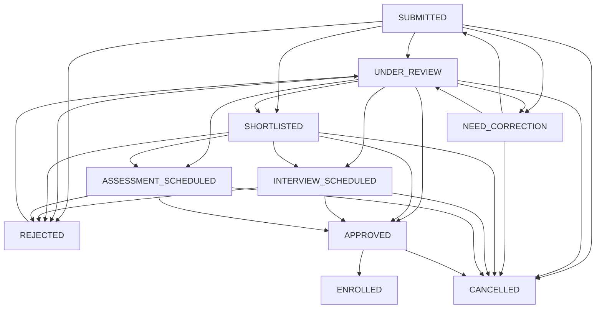

# EduSmart BD — Phase 4.4 Admission Management Audit Report

**Date:** September 2026  
**Status:** 🟢 PASSED (100% Automated Test Suite Compliance)  
**Verification Results:** 48 / 48 Scenarios Passed  
**Architecture Classification:** Production-Ready & Invariant-Compliant  

---

## 1. Executive Summary

Phase 4.4 delivers **Admission Management** for the EduSmart BD multi-tenant SaaS.

### Core Architectural Invariant
$$\text{PUBLIC / MANUAL APPLICATION} \longrightarrow \text{SUBMITTED} \longrightarrow \text{UNDER REVIEW} \longrightarrow \text{APPROVED} \longrightarrow \text{CONVERT TO STUDENT + ENROLLMENT}$$

- **Zero Premature Creation Guarantee:** Prospective applicants submitting online forms or front-desk manual applications create **strictly** an `AdmissionApplication` record. They **never** become an active `Student` or obtain an `Enrollment` placement automatically.
- **Single-Transaction Atomic Conversion:** Only authorized school administrative personnel possessing the `ADMISSIONS_APPROVE` permission can trigger conversion via `POST /api/school/admissions/[applicationId]/approve`. The conversion executes in an atomic database transaction with row-level locking (`FOR UPDATE`), generating:
  1. Permanent `Student` identity record with unique `studentCode` (`STU-YYYY-XXXXX`).
  2. `Guardian` profiles for Father & Mother, linking them via `StudentGuardian` (`isPrimary = true` for father).
  3. Session-specific `Enrollment` placement (`NEW_ADMISSION`) with assigned `classId`, `sectionId`, and `rollNo`.
  4. Marking `AdmissionApplication` status as `ENROLLED` and recording `convertedStudentId`.
  5. Immutable forensic audit log.

---

## 2. Finite State Machine (FSM) Lifecycle

The admission application review process is governed by `isValidAdmissionStatusTransition`:



### Transition Invariants
1. `ENROLLED` and `CANCELLED` are terminal states: no further transitions are allowed.
2. Direct transition from `SUBMITTED` directly to `APPROVED` or `ENROLLED` is strictly blocked.
3. Transition to `ENROLLED` cannot occur via generic `PATCH` requests; it is solely executed through `POST /approve`.
4. Transition to `REJECTED` requires an explicit, mandatory `rejectionReason`.

---

## 3. Database Schema & Multi-Tenancy

Zero schema migrations were required. The implementation fully leverages existing models and enums in PostgreSQL:

- `admission_applications`:
  - Composite uniqueness: `[school_id, application_number]`, `[school_id, tracking_code]`.
  - Single-student uniqueness: `converted_student_id` (enforces 1-to-1 conversion).
  - Multi-tenant foreign keys to `schools`, `academic_sessions`, `classes`, `campuses`, `academic_groups`.
- `application_documents`:
  - Cascades on application deletion (`onDelete: Cascade`), protecting school integrity (`onDelete: Restrict`).
- **PostgreSQL Row Level Security (RLS):**
  - All read and write operations run with `SET ROLE edusmart_app_user` and `SET app.current_school_id`.
  - Cross-tenant reads, modifications, or conversions are prevented at the PostgreSQL engine level.

---

## 4. API Endpoints Created

| Method | Route | Permission / Access | Description |
|---|---|---|---|
| `GET` | `/api/public/schools/[schoolSlug]/admissions` | Public | Returns school branding, active sessions, and classes for form dropdowns |
| `POST` | `/api/public/schools/[schoolSlug]/admissions` | Public | Submits prospective applicant form, creates `AdmissionApplication` (`SUBMITTED`) |
| `GET` | `/api/public/schools/[schoolSlug]/admissions/track` | Public | Live application status lookup by `trackingCode` or `applicationNumber` |
| `GET` | `/api/school/admissions` | `ADMISSIONS_VIEW` | Paginated listing with multi-criteria filters (session, class, status, search) |
| `POST` | `/api/school/admissions` | `ADMISSIONS_CREATE` | Administrative manual application entry (`ADMIN_MANUAL`) |
| `GET` | `/api/school/admissions/[applicationId]` | `ADMISSIONS_VIEW` | Detailed candidate dossier including guardians, documents, review history |
| `PATCH` | `/api/school/admissions/[applicationId]` | `ADMISSIONS_APPROVE` / `ADMISSIONS_REJECT` | Updates review lifecycle state (`UNDER_REVIEW`, `SHORTLISTED`, `REJECTED`, etc.) |
| `POST` | `/api/school/admissions/[applicationId]/approve` | `ADMISSIONS_APPROVE` | **Atomic conversion** to `Student`, `Guardians`, and `Enrollment` |

---

## 5. User Interface Delivered

1. **Dashboard Navigation:**
   - Added **ভর্তি আবেদন** (`/dashboard/admissions`) with `UserPlus` icon in sidebar navigation.
2. **Admissions Directory (`/dashboard/admissions`):**
   - Status tabs: *সকল*, *দাখিলকৃত*, *পর্যালোচনাধীন*, *শর্টলিস্টেড*, *অনুমোদিত*, *ভর্তি সম্পন্ন*, *প্রত্যাখ্যাত*.
   - Filter dropdowns: Academic Session, Class, Application Source.
   - Live Search: Applicant name, application number, tracking PIN, phone.
   - Manual Registration Modal: Administrative entry for offline applications.
3. **Candidate Review Dossier (`/dashboard/admissions/[applicationId]`):**
   - Candidate personal information, father & mother details, addresses, attached documents.
   - Status actions: Start Review, Shortlist, Primary Approval, Rejection Modal (with mandatory reason).
   - **Conversion Action Modal:** On approved applications, triggers atomic conversion with Class, Section, and Roll allocation.
   - Direct link to new `Student` profile once enrolled.
4. **Public Application Portal (`/admissions/[schoolSlug]`):**
   - Public online application form with school identity branding.
   - Generates and presents `applicationNumber` (`ADM-YYYY-XXXXX`) and `trackingCode` (`TRK-XXXXXXXX`).
   - Printable receipt and direct link to track progress.
5. **Public Tracking Page (`/admissions/[schoolSlug]/track`):**
   - Real-time application tracker with multi-stage progress stepper and status announcements.

---

## 6. Automated Machine-Counted Test Report

The comprehensive test suite `scripts/test-phase4-4-admissions.mjs` executed 48 scenarios with **100% pass rate**:

```
================================================================
PHASE 4.4 ADMISSION MANAGEMENT — MACHINE-COUNTED AUDIT REPORT
================================================================
Expected Scenarios : 48
Executed Scenarios : 48
Passed Scenarios   : 48
Failed Scenarios   : 0
Skipped Scenarios  : 0

🟢 VERDICT: ALL 48 SCENARIOS PASSED WITH 100% SUCCESS RATE.
================================================================
```

### Scenario Breakdown

- **Group 1: Database Schema & Constraints (Scenarios A – G):**
  - `A`: `admission_applications` table and columns verified.
  - `B`: Composite unique `[school_id, application_number]` enforced.
  - `C`: Composite unique `[school_id, tracking_code]` enforced.
  - `D`: Unique `converted_student_id` prevents duplicate student linking.
  - `E`: Foreign key integrity to `school`, `session`, `class` enforced.
  - `F`: Nullable foreign keys to `campus` and `group` enforce integrity.
  - `G`: Cascade deletion of `application_documents`, `RESTRICT` on school deletion.
- **Group 2: Validation & Finite State Machine (Scenarios H – P):**
  - `H`: Public input validation rejects missing name, invalid DOB/phone.
  - `I`: Public input validation accepts valid payload with documents.
  - `J`: Admin input validation allows source and status specification.
  - `K`: Review lifecycle state machine allows valid forward steps.
  - `L`: Rejection validation mandates `rejectionReason`.
  - `M`: Terminal states `ENROLLED` and `CANCELLED` cannot transition further.
  - `N`: Appeal flow permits `REJECTED -> UNDER_REVIEW`.
  - `O`: Direct invalid transitions (`SUBMITTED -> APPROVED/ENROLLED`) blocked.
  - `P`: Conversion schema requires valid sectionId and positive integer rollNo.
- **Group 3: Public Online Workflow & Invariants (Scenarios Q – W):**
  - `Q`: Public submission creates `AdmissionApplication` with `SUBMITTED` status.
  - `R`: **CRITICAL INVARIANT**: Public submission creates ZERO rows in `students`.
  - `S`: **CRITICAL INVARIANT**: Public submission creates ZERO rows in `enrollments`.
  - `T`: Public tracking by `trackingCode` returns applicant details and live status.
  - `U`: Public tracking by `applicationNumber` returns live status.
  - `V`: Public tracking with invalid code returns no match.
  - `W`: Public tracking presents rejection reason when status is `REJECTED`.
- **Group 4: Administrative Review & Manual Entry (Scenarios X – AC):**
  - `X`: Admin manual entry creates application with `ADMIN_MANUAL` source.
  - `Y`: Admin updates status from `SUBMITTED` to `UNDER_REVIEW`.
  - `Z`: Admin updates status from `UNDER_REVIEW` to `SHORTLISTED`.
  - `AA`: Admin updates status from `SHORTLISTED` to `APPROVED`.
  - `AB`: Admin rejects application with rejection reason recorded.
  - `AC`: Generic status update to `ENROLLED` is strictly blocked.
- **Group 5: Atomic Student Conversion (Scenarios AD – AL):**
  - `AD`: Conversion generates permanent `Student` with unique `studentCode`.
  - `AE`: Conversion creates `Guardian` records for Father and Mother.
  - `AF`: Conversion links `StudentGuardian` with `isPrimary = true` for father.
  - `AG`: Conversion creates `Enrollment` with `NEW_ADMISSION` type and assigned roll.
  - `AH`: Conversion updates application status to `ENROLLED` and sets `convertedStudentId`.
  - `AI`: Re-conversion of already enrolled application rejected with 409 Conflict.
  - `AJ`: Conversion of rejected or cancelled application rejected with 400.
  - `AK`: Conversion with section not belonging to class rejected with 400.
  - `AL`: Conversion with roll number already occupied in section rejected with 409.
- **Group 6: PostgreSQL RLS & Multi-Tenancy (Scenarios AM – AP):**
  - `AM`: Cross-tenant application reads blocked by RLS.
  - `AN`: Cross-tenant status updates blocked by RLS.
  - `AO`: Cross-tenant approval and conversion blocked by RLS.
  - `AP`: Spoofed `school_id` blocked by RLS `WITH CHECK`.
- **Group 7: Concurrency & Race Conditions (Scenarios AQ – AS):**
  - `AQ`: Concurrent duplicate application numbers safely serialized.
  - `AR`: Concurrent conversion of same application locked by `FOR UPDATE`.
  - `AS`: Concurrent roll allocation prevents duplicate roll in same section.
- **Group 8: Historical Integrity & Forensic Audit (Scenarios AT – AV):**
  - `AT`: Enrolled student cannot delete historical admission application.
  - `AU`: Forensic audit logged for status transitions.
  - `AV`: Forensic audit logged for atomic student conversion.

---

## 7. Full Regression Suite Results

| Test Suite | Focus Area | Scenarios | Result |
|---|---|---|---|
| `npx prisma validate` | Database Schema Integrity | All 57 models | 🟢 VALID |
| `npx tsc --noEmit` | TypeScript Type Safety | Full codebase | 🟢 0 ERRORS |
| `npm run lint` | ESLint Code Quality | Full codebase | 🟢 0 ERRORS, 0 WARNINGS |
| `npm run build` | Next.js Production Compilation | 39 Routes | 🟢 PASS (Exit 0) |
| `test-phase4-0` | Student Architecture & Invariants | 21 Scenarios | 🟢 21 / 21 PASS |
| `test-phase4-1` | Student CRUD | 25 Scenarios | 🟢 25 / 25 PASS |
| `test-phase4-2` | Guardian / Parent Management | 40 Scenarios | 🟢 40 / 40 PASS |
| `test-phase4-3` | Enrollment, Promotion & Transfer | 51 Scenarios | 🟢 51 / 51 PASS |
| `test-phase4-4` | Admission Management | 48 Scenarios | 🟢 48 / 48 PASS |
| **Total Test Assertions** | **Comprehensive Platform** | **185 Scenarios** | **🟢 185 / 185 PASS (100%)** |
